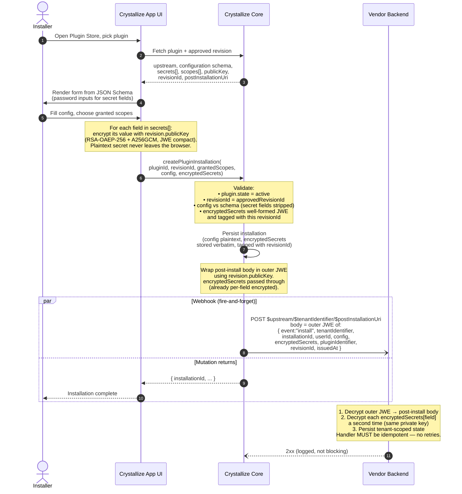

# Crystallize Plugin Contract

This document defines the technical and security conventions every Plugin (vendor-hosted application) must respect to integrate with Crystallize.

A Crystallize Plugin is a vendor-hosted application that extends the Crystallize App UI with custom functionality — rendered inside iframes at predefined placement points. Plugins don't run code in the App UI itself; they receive a scoped Backend Token to act on behalf of the signed-in user via Crystallize APIs, and any secrets they need are encrypted client-side with the vendor's own public key.

Plugins are **server-hosted**. The iframe is loaded via a form POST carrying an encrypted payload that contains the Backend Token, configuration, and secrets. Plugin vendors must operate a backend that can handle POST requests and decrypt the payload — a Cloudflare Worker, Vercel/Netlify edge function, Lambda, or any server-side runtime. Pure static file hosting is not sufficient.

The contract establishes the interface between three parties:

- **Crystallize Core** — manages identity, tenancy, the plugin collection, and the plugin registry
- **Crystallize App UI** — renders buttons, views, configuration forms, and plugin iframes
- **Vendor Upstream** — provides the actual business logic and secure endpoints

---

## Core Concepts

Three entities manage the lifecycle of a plugin from creation to installation.

### Plugin Collection

Where plugins are **defined**. A developer creates a plugin by calling a mutation on `/@me`, providing the plugin metadata (name, description, logo, etc.) and its first revision.

Every plugin has a **state**:

- `pending` — submitted, awaiting validation by Crystallize
- `active` — validated, visible in the Plugin Store and installable
- `inactive` — disabled. The plugin is no longer installable and **stops working immediately across all tenants** (live auth rejects any request made with a token whose `act.pluginId` matches an inactive plugin — the kill is not bounded by token TTL).

A plugin can't be installed until it reaches `active` state.

#### Revisions

A plugin evolves through **revisions**. A revision locks the **contract surface** — the fields that define what the plugin is allowed to do and where it shows up:

- `upstream` — the base URL of the plugin origin
- `entryPoints` — where the plugin appears in the UI
- `scopes` — the permissions the plugin requires
- `configurationSchema` — the JSON Schema defining the install-time configuration form
- `secrets` — which configuration fields are secrets
- `publicKey` — the JWK public key for payload encryption
- `postInstallationUri` — path where Crystallize POSTs installation data
- `version` — vendor-declared semver for this revision

A revision is immutable once submitted. The code running at `upstream` is entirely under the vendor's control — bug fixes, UI changes, and performance improvements can be deployed anytime without a new revision. A new revision is only needed when the contract itself changes.

Plugin-level fields (name, description, logo, etc.) live on the plugin and can be updated independently of revisions. They're cosmetic — they don't affect what the plugin is allowed to do.

Revision fields are locked per revision because they directly affect the Backend Token: when a user installs a plugin, they consent to a specific `upstream`, a specific set of entrypoints, and a specific set of scopes. The token issued at runtime is bounded by that consent. Locking the contract per revision ensures the token always reflects what was approved at installation.

Each plugin carries an `approvedRevisionId` pointer. This is the revision that the Plugin Store surfaces and that new installations default to. Installations pin a specific `revisionId` and **never auto-migrate** — upgrading an installation to a newer revision requires the user to re-install.

The full mutation input is detailed in the [Revision Fields](#revision-fields) section.

### Plugin Registry

Where **installations** live. When a user installs a plugin on their tenant, the Plugin Registry stores the result: which tenant, which plugin, which revision, the non-secret configuration, the granted scopes, and the encrypted secrets.

One plugin can be installed on many tenants, each with its own configuration and scopes. Each `(tenant, plugin)` pair maps to exactly one installation.

To change configuration, scopes, or revision, the plugin must be re-installed. Re-install is atomic and keeps the same `installationId`.

### Plugin Store

The **public-facing catalog** of available plugins. Only plugins in `active` state appear, enriched with marketing content (descriptions, screenshots, vendor info, etc.).

Users browse the Plugin Store in the App UI to discover and install plugins.

---

## Base Requirements

A valid Plugin must satisfy:

1. **Hosting**: a publicly accessible HTTPS domain, operated by the vendor. The origin must accept POST requests and decrypt payloads with the vendor's private key. Pure static hosting is not sufficient.
2. **Plugin registration**: the developer creates the plugin and its first revision via a mutation on `/@me` in Crystallize Core.
3. **Post-installation endpoint**: a path declared in the revision (`postInstallationUri`) where Crystallize POSTs configuration and encrypted secrets at install / reinstall / uninstall time.

---

## Vendor Endpoints

All URLs follow the same pattern:

```
$upstream/$tenantIdentifier/$path
```

- `$upstream` is the plugin's declared `upstream` URL (from the revision).
- `$tenantIdentifier` is the Crystallize tenant the request is scoped to.
- `$path` is either `postInstallationUri` (for install events) or an entrypoint's `target` (for iframe loads).

### Post-Installation Endpoint

When a user installs, re-installs, or uninstalls a plugin on their tenant, Crystallize POSTs a JWE-encrypted body to:

```
$upstream/$tenantIdentifier/$postInstallationUri
```

The plaintext body (after decryption) is:

```ts
type PostInstallBody = {
    event: "install" | "reinstall" | "uninstall";
    tenantIdentifier: string;
    installationId: string;
    userId: string; // installer / actor
    config?: Record<string, JsonValue>; // omitted for uninstall
    encryptedSecrets?: Record<string, string>; // JWE-per-field, omitted for uninstall
    pluginIdentifier: string;
    revisionId: string;
    issuedAt: number; // epoch seconds
};
```

**Delivery semantics**: fire-and-forget, best-effort, **no retries**. A 2xx response counts as success; anything else is logged and ignored. The install/reinstall/uninstall mutation does **not** block on the vendor's response — the user-visible operation completes regardless. Vendors should therefore design their post-install handler to be idempotent and to tolerate losing an occasional event.

### Plugin UI Endpoints

All other endpoints (the ones loaded inside iframes) are addressed by an entrypoint's `target`:

```
$upstream/$tenantIdentifier/$target
```

These endpoints are called via POST. The body contains a single encrypted payload (see [Plugin Loading Protocol](#plugin-loading-protocol)).

The vendor chooses the `target` paths — the entrypoints registered in the revision are the source of truth.

---

## Plugin Definition

The plugin definition is submitted via a mutation on `/@me`. It lives in the Plugin Collection.

The definition has two layers: **plugin-level fields** describing the plugin (updatable anytime) and **revision-level fields** defining the contract (locked per revision).

### Plugin Fields

| Field         | Type     | Description                                                                  |
| ------------- | -------- | ---------------------------------------------------------------------------- |
| `name`        | `string` | Display name of the plugin                                                   |
| `identifier`  | `string` | Reverse-DNS identifier, globally unique, immutable (e.g. `com.acme.invoice`) |
| `author`      | `string` | _(optional)_ Author / vendor name                                            |
| `description` | `string` | _(optional)_ Short description                                               |
| `logo`        | `string` | _(optional)_ URL to a logo image                                             |
| `icon`        | `string` | _(optional)_ URL to an icon image                                            |

### Revision Fields

These define the contract surface and are locked per revision. Changing any of them requires a new revision via `createPluginRevision`.

| Field                 | Type                        | Description                                                                                                                  |
| --------------------- | --------------------------- | ---------------------------------------------------------------------------------------------------------------------------- |
| `upstream`            | `String!`                   | Base HTTPS URL of the plugin origin                                                                                          |
| `entryPoints`         | `[PluginEntryPointInput!]!` | Where the plugin appears in the UI (see [Entrypoints](#entrypoints))                                                         |
| `scopes`              | `[PluginScope!]`            | Permissions the plugin requires (see [Scopes](#scopes))                                                                      |
| `configurationSchema` | `JSON`                      | JSON Schema (draft 2020-12) defining the install-time configuration form (see [Configuration](#configuration))               |
| `secrets`             | `[String!]`                 | Configuration property names to treat as secrets (see [Secrets](#secrets))                                                   |
| `publicKey`           | `PluginPublicKeyInput!`     | JWK public key used to encrypt secrets at install time and the iframe payload at runtime (see [Cryptography](#cryptography)) |
| `postInstallationUri` | `String!`                   | Path where Crystallize POSTs installation data (see [Post-Installation Endpoint](#post-installation-endpoint))               |
| `version`             | `String!`                   | Semver string. The plugin's "current version" is the `version` of `approvedRevisionId`                                       |

```graphql
input CreatePluginRevisionInput {
    upstream: String!
    entryPoints: [PluginEntryPointInput!]!
    scopes: [PluginScope!]
    configurationSchema: JSON
    secrets: [String!]
    publicKey: PluginPublicKeyInput!
    postInstallationUri: String!
    version: String!
}
```

### Scopes

The `scopes` field declares the permissions the plugin needs. This is what the installer reviews before granting access.

```json
{
    "scopes": ["order:read", "order:write", "customer:read"]
}
```

At install time:

1. The installer **must hold all requested scopes** — you can't install a plugin that asks for permissions you don't have.
2. The installer **can restrict** the granted scopes to a subset. For example, if the plugin asks for `order:read` and `order:write`, the installer can grant only `order:read`.

> **V1 behavior:** granted scopes are recorded on the installation but are **not** enforced when minting the Backend Token. In V1, the Backend Token carries the current user's full permissions (bounded by the user's own role, as always). Scope intersection enforcement — narrowing the token to `grantedScopes ∩ userPermissions` — is planned for V2. Declare scopes honestly now so that the installer's consent is meaningful and so that V2 will "just work" for your plugin.

### Cryptography

The revision must include a `publicKey` object in JWK format (RFC 7517). This key serves two purposes:

1. **At install time**: encrypt each secret configuration value individually (client-side, in the App UI) before submitting to Crystallize.
2. **At runtime**: encrypt the entire iframe payload on every load (server-side, in Crystallize Core).

Only the vendor holds the matching private key. Crystallize never holds plaintext secrets.

The key must be an RSA key with:

| JWK field | Required value |
| --------- | -------------- |
| `kty`     | `RSA`          |
| `use`     | `enc`          |
| `alg`     | `RSA-OAEP-256` |
| `enc`     | `A256GCM`      |

JWE compact serialization is used on the wire.

```json
{
    "publicKey": {
        "kty": "RSA",
        "kid": "public",
        "use": "enc",
        "alg": "RSA-OAEP-256",
        "enc": "A256GCM",
        "n": "<modulus>",
        "e": "AQAB"
    }
}
```

### Configuration

A plugin is a single application deployed once by the vendor, but it can be installed on many tenants, each with its own context. The configuration is what makes each installation unique.

The revision declares the **shape** of the configuration as a JSON Schema. When a user installs the plugin, the App UI renders that schema as a form. The values the user fills in become that installation's specific configuration.

The same Invoice App can be installed on Tenant A with a purple theme pointing to Stripe instance X, and on Tenant B with a blue theme pointing to Stripe instance Y. The plugin code is identical — the configuration is what differentiates each installation.

Configuration is set at installation time and stored in the Plugin Registry. Non-secret values are stored in plaintext; secrets are stored as ciphertext (see below). To change any of it, the plugin must be re-installed.

The `configurationSchema` field must be a valid **JSON Schema, draft 2020-12**.

```json
{
    "configurationSchema": {
        "$schema": "https://json-schema.org/draft/2020-12/schema",
        "type": "object",
        "additionalProperties": false,
        "required": ["organizations"],
        "properties": {
            "StripeApiKey": {
                "type": "string",
                "title": "Stripe API Key",
                "description": "API Key of the Stripe instance"
            },
            "organizations": {
                "type": "array",
                "minItems": 1,
                "items": {
                    "type": "object",
                    "additionalProperties": false,
                    "required": ["label", "email"],
                    "properties": {
                        "label": {
                            "type": "string",
                            "title": "Organization Label"
                        },
                        "email": {
                            "type": "string",
                            "title": "Organization Email"
                        },
                        "address": {
                            "type": "string",
                            "title": "Organization Address"
                        }
                    }
                }
            }
        }
    }
}
```

At install and re-install, Crystallize validates the submitted `config` against this schema (with secret-field nodes excluded from the validated subset).

### Secrets

A top-level array of configuration property names to treat as secrets:

```json
{
    "secrets": ["StripeApiKey", "mySuperSecretPassword"]
}
```

Every name in `secrets[]` must resolve to a property in `configuration`.

When a property is listed in `secrets`, the App UI:

1. Renders an `<input type="password">` for that field.
2. **Encrypts the value in the browser** using the plugin's `publicKey`, producing a JWE compact string.
3. Submits `{ config, encryptedSecrets }` to Crystallize. The plaintext secret value never leaves the user's browser.

Crystallize stores the ciphertext verbatim. Each stored ciphertext is tagged with the `revisionId` it was encrypted against.

**Re-install rules:**

- If the user re-installs against the **same revision** and leaves a secret field blank, the existing ciphertext is preserved (passthrough).
- If the user re-installs against a **new revision**, every secret must be re-encrypted against the new revision's `publicKey`. Crystallize rejects stale-tagged ciphertexts to prevent silent leaks if a vendor rotates keys.

At runtime, Crystallize passes the stored ciphertexts through into the iframe payload as-is. The payload itself is then wrapped in an outer JWE using the same `publicKey`. The plugin's backend:

1. Decrypts the outer envelope to retrieve the payload plaintext.
2. Reads `encryptedSecrets[field]` — a per-field JWE — and decrypts it a second time with the same private key.

Only the vendor can decrypt secrets. Crystallize never holds plaintext.

### Entrypoints

Entrypoints declare where the plugin appears in the Crystallize App UI. Each entrypoint defines a unique placement.

Placements follow the convention:

```
$CONCERN/$VIEW/$PLACEMENT(/$TYPE?)
```

- **concern** — the domain entity: `order`, `customer`, `subscription-contract`, `dashboard`, …
- **view** — which view on that entity: `view`, `edit`, `nerdy`, `developer`, `create`
- **placement** — where on that page: `toolbar-button`, `main`, `side-widget`, `main-widget`
- **type** _(optional)_ — how the UI renders it: `dialog`, `widget`, `link`

Examples:

```
orders/nerdy/toolbar-button           (dialog by design)
orders/nerdy/toolbar-action/link      (redirect by design)
orders/nerdy/toolbar-action/button    (dialog by design)
orders/nerdy/main-widget              (inline by design)
order/view/main                       (widget by design)
order/view/toolbar-button             (dialog by design)
order/view/sidebar                    (widget by design)
```

In V1, `placement` is a free string (no enum enforcement). Stick to the convention so your plugin lines up with where the App UI actually renders entrypoints.

Each entrypoint has the following fields:

| Field       | Type     | Description                                                                                                                              |
| ----------- | -------- | ---------------------------------------------------------------------------------------------------------------------------------------- |
| `id`        | `string` | _Server-assigned_ at revision creation. Used by the App UI in `issuePluginPayload(installationId, entryPointId)`.                        |
| `placement` | `string` | The `$CONCERN/$VIEW/$PLACEMENT(/$TYPE?)` identifier                                                                                      |
| `target`    | `string` | URI path suffix appended to `$upstream/$tenantIdentifier/`. Must start with `/`, must not contain `://`, must not contain `..` segments. |
| `label`     | `string` | _(optional)_ Display label                                                                                                               |
| `icon`      | `string` | _(optional)_ URL to an icon                                                                                                              |

#### Entity Context

Most concerns (`order`, `customer`, `subscription-contract`, …) are entity-scoped — the plugin appears on a page tied to a specific resource. For entity-scoped entrypoints, the App UI passes the entity context (at minimum the entity ID) in the payload so the plugin knows which resource is currently on screen.

Some concerns, such as `dashboard`, are not entity-scoped — the plugin operates at the tenant level. For those, `entityContext` is omitted from the payload.

#### Examples

A plugin adding a "Preview Order" button on both the Order view and edit pages, plus a dashboard widget:

```json
{
    "entryPoints": [
        {
            "placement": "order/view/toolbar-button",
            "target": "/order/preview",
            "label": "Preview Order",
            "icon": "https://example.com/icon.png"
        },
        {
            "placement": "order/edit/toolbar-button",
            "target": "/order/preview",
            "label": "Preview Order",
            "icon": "https://example.com/icon.png"
        },
        {
            "placement": "order/edit/main-widget",
            "target": "/order/edit-widget",
            "label": "Order Edition Customer documentation"
        },
        {
            "placement": "dashboard/view/main",
            "target": "/dashboard/main",
            "label": "Tenant Overview"
        }
    ]
}
```

Note that `order/edit/main-widget` and `order/edit/toolbar-button` are two distinct positions on the same page. Without `view` in the placement, there would be no way to distinguish `order/edit/main` from `order/view/main`.

---

## Installation Flow

End-to-end sequence when a user installs a plugin on their tenant. The same shape applies to re-install (`event: "reinstall"`) and uninstall (`event: "uninstall"`, no `config` / `encryptedSecrets` in the webhook body).



**Notes on the flow**

- Crystallize never sees plaintext secret values. The only party that can decrypt them is the vendor, who holds the private key matching `revision.publicKey`.
- The webhook is delivered once, best-effort. If the vendor is down, the install still completes — the authoritative state is always re-delivered on the next iframe load (see below).
- Re-install with a new `revisionId` requires the browser to re-encrypt **all** secret fields against the new revision's `publicKey`. Core rejects stale-tagged ciphertexts.
- Re-install against the **same** `revisionId` may leave secret fields blank; existing ciphertexts are preserved (passthrough).

---

## Plugin Loading Protocol

The App UI uses a **form-submit-to-named-iframe** pattern to load each entrypoint:

1. The App UI calls `issuePluginPayload(installationId, entryPointId, entityContext?)` on Crystallize Core. The server returns `{ url, encryptedPayload }`, where `url` is `$upstream/$tenantIdentifier/$target` and `encryptedPayload` is a JWE compact string.
2. An **empty** iframe is rendered with a `name` attribute.
3. A hidden `<form>` targets that iframe by name and submits via `POST`.

```html
<iframe name="plugin-frame-<entryPointId>"></iframe>
<form method="POST" action="<url>" target="plugin-frame-<entryPointId>">
    <input type="hidden" name="payload" value="<encryptedPayload>" />
</form>
```

### Encrypted Payload

The POST body contains a single encrypted payload, built by Crystallize Core and encrypted with the revision's `publicKey`. After decryption, the plaintext shape is:

```ts
type PluginPayloadPlaintext = {
    backendToken: string; // RS256 JWT — see next section
    configuration: Record<string, JsonValue>; // plaintext non-secret settings
    encryptedSecrets: Record<string, string>; // per-field JWE compact strings
    entityContext?: Record<string, JsonValue>; // e.g. { orderId: "..." }, omitted for non-entity concerns
    installationId: string;
    tenantIdentifier: string;
    pluginIdentifier: string; // reverse-DNS; sanity-check that this matches you
    revisionId: string;
    userId: string; // the viewing user; redundant with backendToken.sub
    issuedAt: number; // epoch seconds
    expiresAt: number; // epoch seconds, matches backendToken.exp
};
```

This pattern provides:

- No sensitive data in the URL or query string
- Nothing in server/CDN access logs
- No browser history pollution
- No URL length limits
- A single round-trip on load (POST, not GET)
- End-to-end encryption between Crystallize Core and the plugin's backend

The plugin origin must accept the POST, decrypt the payload, and return HTML.

### Loading Flow

End-to-end sequence for rendering one entrypoint in the App UI.

```mermaid
sequenceDiagram
    autonumber
    actor Viewer
    participant AppUI as Crystallize App UI
    participant Core as Crystallize Core
    participant Frame as Browser iframe
    participant Vendor as Vendor Backend
    participant API as Crystallize API

    Viewer->>AppUI: Navigate to page<br/>(e.g. order/view/123)
    AppUI->>Core: List installed entrypoints<br/>matching placement for this page
    Core-->>AppUI: [{ installationId, entryPointId,<br/>   label, icon, ... }]

    loop For each matching entrypoint
        AppUI->>Core: issuePluginPayload(<br/>installationId, entryPointId,<br/>entityContext?)

        Note over Core: 1. Check plugin.state = active<br/>2. Mint Backend Token (RS256 JWT):<br/>   iss = Core base URL<br/>   sub = viewing userId<br/>   aud = pluginIdentifier<br/>   exp = iat + 3600<br/>   act = { pluginId, installationId, revisionId }<br/>3. Assemble plaintext payload:<br/>   { backendToken, config,<br/>     encryptedSecrets (passthrough),<br/>     entityContext, installationId,<br/>     tenantIdentifier, pluginIdentifier,<br/>     revisionId, userId,<br/>     issuedAt, expiresAt }<br/>4. Wrap plaintext in outer JWE<br/>   using revision.publicKey

        Core-->>AppUI: { url: $upstream/$tenantIdentifier/$target,<br/>  encryptedPayload }

        AppUI->>AppUI: Render empty &lt;iframe name=...&gt;<br/>+ hidden &lt;form method=POST action=url<br/>   target=iframeName&gt;<br/>  &lt;input name="payload"<br/>   value="&lt;encryptedPayload&gt;"&gt;

        AppUI->>Frame: Auto-submit form
        Frame->>Vendor: POST $upstream/$tenantIdentifier/$target<br/>body: payload=&lt;encryptedPayload&gt;

        Note over Vendor: 1. Decrypt outer JWE → plaintext payload<br/>2. Verify backendToken via JWKS<br/>   ($CORE/.well-known/jwks.json):<br/>   iss, aud, exp, act<br/>3. Decrypt encryptedSecrets[field]<br/>   on demand (same private key)

        opt Vendor calls Crystallize APIs on behalf of the viewer
            Vendor->>API: Request<br/>Authorization: Bearer &lt;backendToken&gt;

            Note over API: • Verify RS256 signature via JWKS<br/>• Load real user by sub = userId<br/>• Live plugin-state check:<br/>  reject if plugin not active<br/>  (not bounded by token TTL)<br/>• Apply user's permissions

            API-->>Vendor: Response
        end

        Vendor-->>Frame: HTML
        Frame-->>Viewer: Rendered plugin UI
    end
```

**Notes on the flow**

- The URL is assembled server-side — the App UI treats `url` as opaque and never composes it from parts.
- Nothing sensitive appears in the iframe's `src` or in any URL. The encrypted payload rides in the POST body.
- The `inactive` kill-switch is enforced at the API boundary on every call, not just at token issue time — a token minted just before a plugin is disabled stops working immediately.
- Vendors who skip token verification can still read `userId` / `pluginIdentifier` / `revisionId` from the plaintext payload for display purposes, but any call back to Crystallize APIs requires the Bearer token — which Crystallize verifies end-to-end.

---

## Backend Token

The Backend Token is generated by Crystallize Core on every plugin load and delivered inside the encrypted payload. No exchange step is required — the plugin uses it immediately to call Crystallize APIs server-side.

The token **impersonates the visitor** (the user currently viewing the page).

### Format

RS256 JWT, signed by Crystallize Core.

### Claims

| Claim | Value                                                                                                                   |
| ----- | ----------------------------------------------------------------------------------------------------------------------- |
| `iss` | Crystallize Core base URL                                                                                               |
| `sub` | The viewing user's `userId`                                                                                             |
| `aud` | Your plugin's `identifier` (reverse-DNS)                                                                                |
| `exp` | `iat + 3600` (1 hour TTL)                                                                                               |
| `iat` | Issue time (epoch seconds)                                                                                              |
| `jti` | Random UUID                                                                                                             |
| `act` | `{ pluginId, installationId, revisionId }` — RFC 8693 "actor" claim, identifies the plugin acting on behalf of the user |

### Verification

Verify every token you receive:

1. Fetch Crystallize's public JWKS at `$CORE_BASE_URL/.well-known/jwks.json`.
2. Verify the RS256 signature.
3. Check `iss` matches the Crystallize Core base URL you expect.
4. Check `aud` matches your plugin's `identifier`.
5. Check `exp` is in the future.
6. Check `act.pluginId` / `act.installationId` / `act.revisionId` match the installation you're handling.

Send the token as a `Bearer` credential:

```
Authorization: Bearer <jwt>
```

Crystallize's incoming auth pipeline verifies the token against the JWKS, rejects it if the plugin is not currently in `active` state (live check, not TTL-bounded), and produces a normal user context with `act` surfaced as the `via` field.

---

## Permissions Model

Plugin permissions follow **least privilege**:

1. The plugin revision declares the permissions the plugin requires (`scopes`).
2. At install time, the installer (who must hold all requested permissions) can restrict the granted scopes to a subset.
3. At runtime, the effective permissions are — conceptually — the **intersection** of:
    - The scopes granted to the plugin at installation
    - The current viewing user's own permissions

This means a plugin can never escalate a user's privileges. If a user has read-only access to orders, the plugin cannot write orders on their behalf — regardless of what the plugin requested.

> **V1 behavior:** the Backend Token currently carries the viewing user's full permissions. `grantedScopes` is stored on the installation but not yet enforced when minting the token. The user's own permissions still bound the token in the usual way. Scope-intersection enforcement is planned for V2; declaring accurate scopes now is still the right thing to do — the installer's consent is recorded and becomes binding in V2 without any vendor change.

---

## Security Considerations

- **Plugin validation**. Plugins must be approved by Crystallize before they become installable. The state model (`pending` → `active`) ensures nothing runs without review. `inactive` is a live kill-switch that invalidates every outstanding Backend Token for the plugin regardless of TTL.
- **Revision locking**. Each revision locks the contract surface (upstream URL, entrypoints, scopes, configuration, secrets, public key, post-installation URI, version). The contract the user approved at install time is the one that runs. Code changes at `upstream` don't require a new revision; changes to the contract itself do.
- **Pinned installations**. Installations pin a specific `revisionId` and never auto-migrate. The user has to re-install to move to a newer revision — at which point they re-consent to the new contract and re-encrypt all secrets against the new public key.
- **End-to-end payload encryption**. Every iframe load delivers a JWE-encrypted payload that only the plugin's backend can decrypt. The Backend Token, configuration, entity context, and secrets are never readable in the DOM or in any intermediate layer.
- **Secrets isolation**. Secret configuration values are encrypted in the installer's browser using the revision's `publicKey` and are stored as ciphertext only. The outer payload envelope is then encrypted again with the same public key. Crystallize never sees plaintext secrets — not during install, not during storage, not during runtime delivery, not during the post-install webhook.
- **No code execution in the UI**. The App UI only renders iframes, links, and forms. No vendor code runs in the App UI's JavaScript context.
- **Plugin-to-App UI communication**. A defined protocol (postMessage-based) governs iframe ↔ parent communication, with a shared library for common operations (open, close, select).
- **Vendor trust**. Installing a plugin means trusting the vendor with any secrets passed. The Plugin Store surfaces vendor identity clearly.
- **Webhook idempotency**. The post-install webhook is fire-and-forget with no retries. Design your handler to be idempotent and to tolerate occasional lost events — the authoritative state always lives on the next iframe load's payload, which carries full `config` and `encryptedSecrets`.
